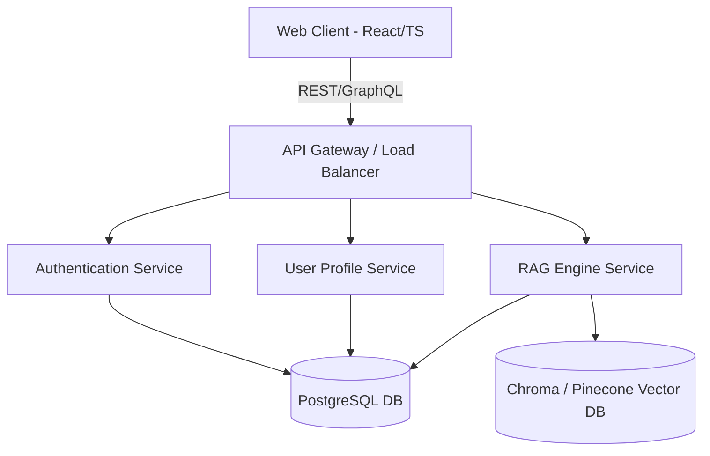

# System Architecture

This diagram illustrates the high-level architecture of PlacementBrain, showing the relationship between the client, backend services, and databases.

```mermaid
graph TD
    Client[Web Client - React/TS]
    API_Gateway[API Gateway / Load Balancer]
    AuthService[Authentication Service]
    UserService[User Profile Service]
    RAGService[RAG Engine Service]
    Database[(PostgreSQL DB)]
    VectorDB[(Chroma / Pinecone Vector DB)]

    Client -->|REST/GraphQL| API_Gateway
    API_Gateway --> AuthService
    API_Gateway --> UserService
    API_Gateway --> RAGService
    
    AuthService --> Database
    UserService --> Database
    RAGService --> VectorDB
    RAGService --> Database
```
