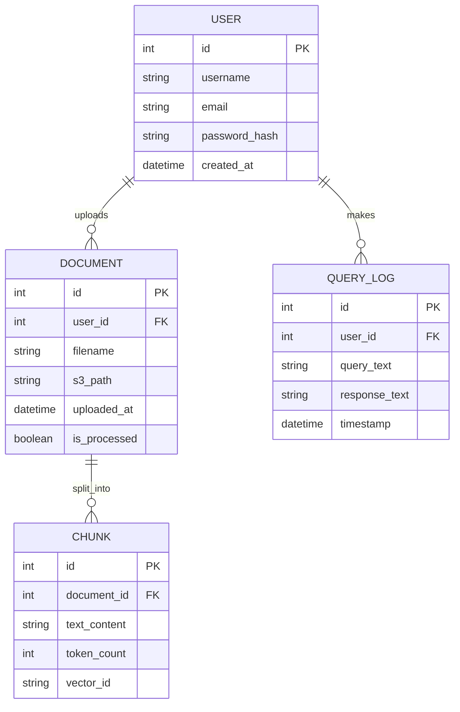

# Database Entity-Relationship Diagram

This diagram outlines the core data models used within PlacementBrain.

```mermaid
erDiagram
    USER ||--o{ DOCUMENT : uploads
    USER ||--o{ QUERY_LOG : makes
    USER {
        int id PK
        string username
        string email
        string password_hash
        datetime created_at
    }
    DOCUMENT {
        int id PK
        int user_id FK
        string filename
        string s3_path
        datetime uploaded_at
        boolean is_processed
    }
    DOCUMENT ||--o{ CHUNK : split_into
    CHUNK {
        int id PK
        int document_id FK
        string text_content
        int token_count
        string vector_id
    }
    QUERY_LOG {
        int id PK
        int user_id FK
        string query_text
        string response_text
        datetime timestamp
    }
```
