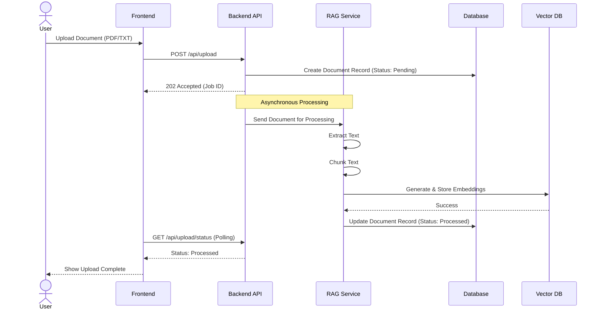

# Sequence Diagram

This sequence diagram illustrates the process of uploading a document and how the system embeds it for RAG (Retrieval-Augmented Generation).

```mermaid
sequenceDiagram
    actor User
    participant Frontend
    participant Backend API
    participant RAG Service
    participant Database
    participant Vector DB

    User->>Frontend: Upload Document (PDF/TXT)
    Frontend->>Backend API: POST /api/upload
    Backend API->>Database: Create Document Record (Status: Pending)
    Backend API-->>Frontend: 202 Accepted (Job ID)
    
    Note over Backend API, RAG Service: Asynchronous Processing
    Backend API->>RAG Service: Send Document for Processing
    
    RAG Service->>RAG Service: Extract Text
    RAG Service->>RAG Service: Chunk Text
    RAG Service->>Vector DB: Generate & Store Embeddings
    Vector DB-->>RAG Service: Success
    
    RAG Service->>Database: Update Document Record (Status: Processed)
    
    Frontend->>Backend API: GET /api/upload/status (Polling)
    Backend API-->>Frontend: Status: Processed
    Frontend-->>User: Show Upload Complete
```
