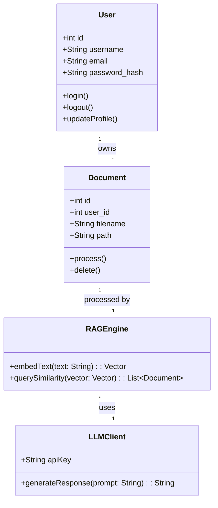

# UML Class Diagram

This UML diagram outlines the core backend classes and their relationships.

```mermaid
classDiagram
    class User {
        +int id
        +String username
        +String email
        +String password_hash
        +login()
        +logout()
        +updateProfile()
    }
    
    class Document {
        +int id
        +int user_id
        +String filename
        +String path
        +process()
        +delete()
    }
    
    class RAGEngine {
        +embedText(text: String): Vector
        +querySimilarity(vector: Vector): List~Document~
    }
    
    class LLMClient {
        +String apiKey
        +generateResponse(prompt: String): String
    }
    
    User "1" -- "*" Document : owns
    Document "1" -- "1" RAGEngine : processed by
    RAGEngine "*" -- "1" LLMClient : uses
```
