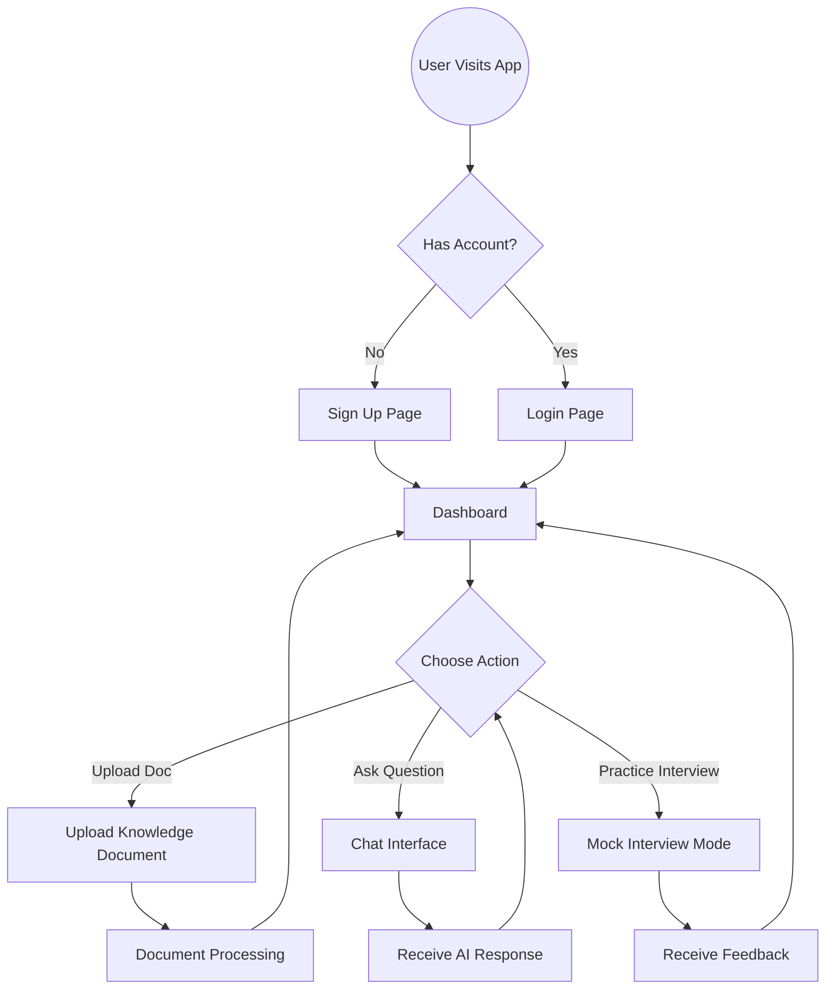

# User Flow

This diagram shows the typical journey of a user interacting with PlacementBrain.

```mermaid
flowchart TD
    Start((User Visits App)) --> HasAccount{Has Account?}
    HasAccount -- No --> Signup[Sign Up Page]
    Signup --> Dashboard
    HasAccount -- Yes --> Login[Login Page]
    Login --> Dashboard

    Dashboard --> ActionChoice{Choose Action}
    
    ActionChoice -- Upload Doc --> Upload[Upload Knowledge Document]
    Upload --> Processing[Document Processing]
    Processing --> Dashboard
    
    ActionChoice -- Ask Question --> Chat[Chat Interface]
    Chat --> AIResponse[Receive AI Response]
    AIResponse --> ActionChoice
    
    ActionChoice -- Practice Interview --> Interview[Mock Interview Mode]
    Interview --> Feedback[Receive Feedback]
    Feedback --> Dashboard
```
